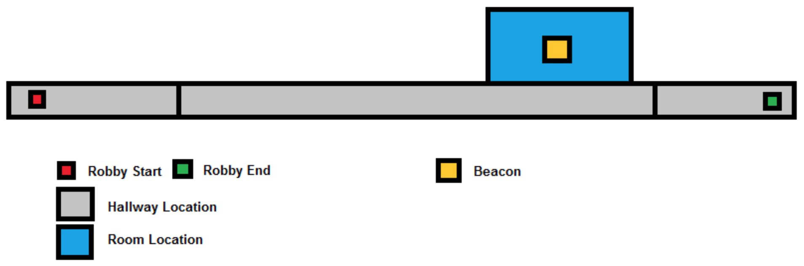
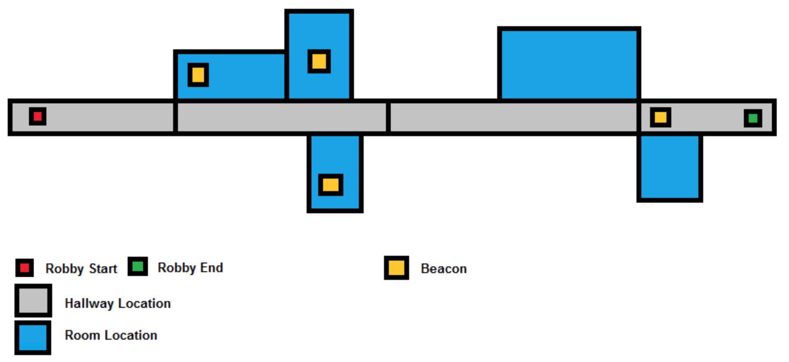
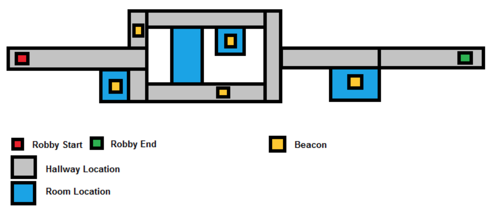

# HTN-Lab

## Rescue Robot Domain

In this assignment you will formalise Robby, a search and report robot. Robby’s job is to navigate the mundane world of office hallways and rooms in the event of some unforeseen disaster, and look out for resources to rescue.

For this project, we will model a simple model of the world that Robby has to work in. This is essentially a long office hallway that is split into various segments or hallway-locations. These hallway- locations may or may not be connected to various rooms.

This world two different types of locations, hallways and rooms. Robby can be “at” a particular location at a given point, and only at that location. Two locations can be “connected” to each other, enabling Robby to navigate between them (regardless of whether they are rooms or hallways). Note that connections are symmetric, so you need to model the fact that if Robby can go from A to B, then going from B to A is also possible. You can also assume that a hallway-location is a whole object - if Robby is anywhere in a given hallway-location, then Robby can enter any of the rooms connected to that hallway-location, and move from/to any of the other hallway-locations connected to it.

Navigating between hallway-locations and rooms is achieved via “enter” and “exit” actions. The enter action enables moving from a hallway-location to a room, while the exit action enables the opposite - moving from a room to a hallway-location. Remember that the two need to be connected in order to perform an enter or an exit - and you need to model those connections.

To navigate between two connected hallway-locations, Robby uses a special “move” action that only works on locations of type hallway. In the domain and problems that you are to model, Robby should not move within rooms or from one room to another directly, and only enters and exits from hallway- locations.

To ensure that Robby doesn’t cheat and visits all locations of interest, there are special beacons “in” those locations. The beacons can be in either hallway-locations or rooms (since they both are subtypes of “location”). Robby needs to necessarily be at a given location in order to spot the beacon at that location. Once Robby spots and “reports” that beacon, he can move on to the next task at hand (so you may want to model the reporting of beacons as goals). Finally, there is a destination that Robby must end up at - this is another goal that you must model.

Your assignment is to develop a domain file from the specification above in HTN, and then model the situations depicted in the images below as individual problem files.

## Primitives

```elisp
(:action enter
  :parameters (?bot - robot ?source - hallway ?destination - room)
  :precondition (and
    (at ?bot ?source)
    (not (at ?bot ?destination))
    (connected ?source ?destination)
  )
  :effect (and
    (not (at ?bot ?source))
    (at ?bot ?destination)
  )
)
```

```elisp
(:action exit
  :parameters (?bot - robot ?source - room ?destination - hallway)
  :precondition (and
    (at ?bot ?source)
    (not (at ?bot ?destination))
    (connected ?source ?destination)
  )
  :effect (and
    (not (at ?bot ?source))
    (at ?bot ?destination)
  )
)
```

```elisp
(:action move
  :parameters (?bot - robot ?source - hallway ?destination - hallway)
  :precondition (and
    (at ?bot ?source)
    (not (at ?bot ?destination))
    (connected ?source ?destination)
  )
  :effect (and
    (not (at ?bot ?source))
    (at ?bot ?destination)
  )
)
```

```elisp
 (:action report
  :parameters (?bot - robot ?source - location ?beacon - beacon)
  :precondition (and
    (at ?bot ?source)
    (in ?beacon ?source)
    (not (reported ?bot ?beacon))
  )
  :effect (reported ?bot ?beacon)
)
```

## Problems

### Problem 1


---

### Problem 2


---

### Problem 3


## Questions

- How to make a method to move to any location?
- How to make a method that reports all beacons?

You must submit the solution (domain and problems) and the answer to the questions at moodle.
